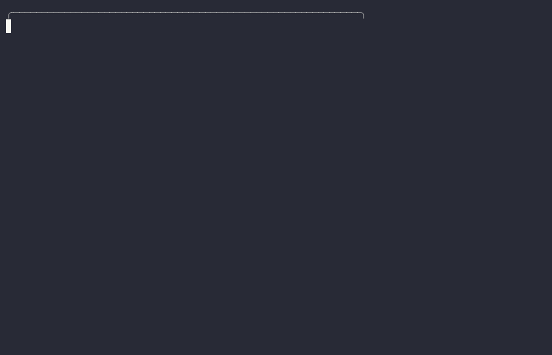

# Belay

**Risk-tiered protection for AI-driven development.**

In climbing, your belayer doesn't climb the route for you. They hold the rope, they check your knots before you leave the ground, and how much protection you rig depends on the grade — you don't place gear every two feet on a scramble, and you don't free-solo the crux. That's exactly what Belay does for your Claude Code sessions:

- **Every delegated task gets routed by risk.** Not everything deserves your most expensive model. A project tier × task level rubric picks the model and effort per task, so mechanical work runs cheap and critical work runs strong.
- **A second is on the rope where falls actually happen.** Plans (where errors compound) and phase gates (where structural defects surface) get an independent reviewer from a different model family. Per-task double-checking is deliberately *not* here — it adds latency, not safety.
- **Your progress is anchored.** Checkpoints make orchestration state resumable by any session on any model. If a session dies mid-route, the next one clips into the last anchor and keeps climbing — nothing lost, nothing repeated.

No queues, no daemons, no state stores. Belay is conventions over infrastructure: four skills that run on Claude Code's own primitives and degrade to plain Claude Code if any piece is missing.

## What it looks like



*That's a real session ([full transcript](docs/demo.md); replay it locally with `asciinema play docs/demo.cast`).*

Your first climb with an untiered project costs you exactly one question, once:

> **You:** Add CSV export for invoices in billflow.
>
> **Claude:** Billflow has no `.claude/workflow.md` yet — inferring **T2 Personal product**, confirm? *(you confirm)* Persisted. Routing: L2 Standard → **Sonnet, medium effort**, spot-check review only — no gate ceremony, because a pre-launch app at L2 doesn't earn any.

## The rack

Four skills, each with one job:

| Skill | What it does for you |
|---|---|
| `task-router` | Grades every route before anyone climbs. **Project tier** (T1 production / T2 personal product / T3 throwaway) × **task level** (L1 mechanical → L4 critical) picks the model, the effort, and the review depth — instead of everything silently inheriting your session model. Asks you the tier once per project, writes it to `.claude/workflow.md`, never asks again. Escalates effort before model when a worker struggles; downgrades levels that keep reviewing clean. |
| `codex-plan-review` | Checks your knots before you leave the ground. An independent reviewer (OpenAI Codex) reads the plan against the codebase before any work dispatches — T1 always, T2 for multi-phase plans. Blocking-only severity, hard 2-revision cap, and every finding gets verified against primary evidence before it changes your plan. |
| `codex-gate-review` | The second on the rope at the crux. Dual sign-off at phase gates and L4 tasks only — the reviewer gets your real diff, executed test output, and acceptance criteria, never summaries. If the reviewer's unavailable, you're told and the climb continues on internal review; an outage never strands you. |
| `handoff-checkpoint` | Places your anchors. After each task wave, orchestration state — task graph, decisions, validation state, and a mandatory "next action" line — gets written where any future session can find it. Resume checks git before redispatching anything, so you never lose ground and never redo it either. |

## Tie in

**As a plugin (recommended).** In Claude Code:

```
/plugin marketplace add cwaku/belay
/plugin install belay@belay
```

**Or plain copy:**

```bash
git clone https://github.com/cwaku/belay.git
cd belay && ./install.sh
```

Pick one — installing both ways registers every skill twice.

**Make it stick.** Skills trigger by description; the strongest guarantee is a standing instruction in every session. `install.sh` drops `templates/CLAUDE.md` into `~/.claude/CLAUDE.md` if you don't have one (it will never touch an existing file — merge the bullets yourself in that case).

## How you'll actually use it

You won't. That's the point — you prompt like you always have, and Belay fires on **delegation-shaped work**: plans being executed, tasks being handed to subagents. Not on every message.

- **A project you've already tiered:** routing is silent. You see the decision in the task brief, nothing else.
- **A new project:** one tier question, then never again.
- **Small direct work** ("fix this typo"): nothing triggers, correctly. Heads up: undelegated work runs on your *session* model — Belay protects the climbs, not the walk to the crag.
- **A big feature in a T1 project:** plan review → routed dispatch → checkpoints → gate review → and the merge always stops and asks *you*. Your involvement on a clean run: the original prompt and one yes.

Honest caveat: triggering is instruction-driven, not mechanically enforced. If a session ever barrels past it, "use task-router" puts it back on rope. For hard enforcement, add a `PreToolUse` hook that flags Agent calls without an explicit model.

## Bring your whole rack to a new machine

Belay installs only its own four skills. The rest of your environment — plugins, personal skills, your global `CLAUDE.md` — lives in `~/.claude/` and doesn't transfer by itself. Two scripts close the gap:

```bash
./scripts/export-setup.sh                  # here → writes my-setup/
./scripts/import-setup.sh                  # there → interactive picker
./scripts/import-setup.sh --recommended    # just the Belay-paired plugins
./scripts/import-setup.sh --all            # everything
./scripts/import-setup.sh --from ~/dotfiles  # read from a cloned dotfiles repo
```

The importer walks you through each plugin and skill with accept/skip prompts. The three that pair with Belay — `superpowers` (plan-execution discipline), `claude-mem` (cross-session memory your checkpoints benefit from), `code-review` (the internal pass the gate runs alongside) — are marked `[recommended]` and default to yes. Everything else defaults to no, so someone running *your* dotfiles adopts your taste deliberately, not by accident.

**Publishing your export as public dotfiles works** — it contains no secrets by construction (plugin names, marketplace repos; scan yours anyway: `grep -rniE "api[_-]?key|secret|token|password" my-setup/`). It's gitignored *here* so this repo stays generic; the author's own [claude-dotfiles](https://github.com/cwaku/claude-dotfiles) is the reference layout, consumed with `--from`. Three things to know: exported skills are often vendored third-party work (keep attribution, check upstream licenses — or exclude machine-managed ones with `EXPORT_SKIP="name" ./scripts/export-setup.sh`); plugin *data* stays put (a memory plugin's database doesn't travel); and marketplaces added interactively can't be exported from settings — the importer detects those and prints the exact `/plugin` commands to finish.

## Per-project setup

Each project declares its tier in `<project>/.claude/workflow.md` ([template](templates/workflow.md)) — including its own **L4 surfaces**, the things that always get maximum protection: for an API that might be auth endpoints and data deletion; for a trading system, order execution and verdict logic. If the file is missing, `task-router` infers a tier, asks you once, writes it. The tier shifts the whole review ladder, so your coursework never pays production-grade overhead and your production paths never get coursework-grade review.

## What you need

- Claude Code with plugin support.
- Optional: [Codex CLI](https://github.com/openai/codex), authenticated (`codex login`), for the two review skills. Without it they tell you "Codex unavailable" and fall back to internal review — nothing blocks. Any independent reviewer CLI can be swapped in by editing two command lines.

## Why it's built this way

- **Why a different model family for review?** A model reviewing its own family's output shares its blind spots. Independence is the whole point of a belayer — and it's spent only where it pays: plans and gates.
- **Why capped review loops?** Two reviewers disagreeing without a cap is an infinite approval loop. Two cycles, then *you* decide; overrides are logged, never silent.
- **What's deliberately missing:** learned/automatic routing, agent federation, background workers, external state stores. If you want a platform, there are heavier tools. Belay is the rope, not the mountain railway.
- Project-specific skills (a repo's production-shape checks, environment preflight) belong in that repo's own `.claude/skills/`, versioned with the code they protect — not here.

## License

[MIT](LICENSE)
